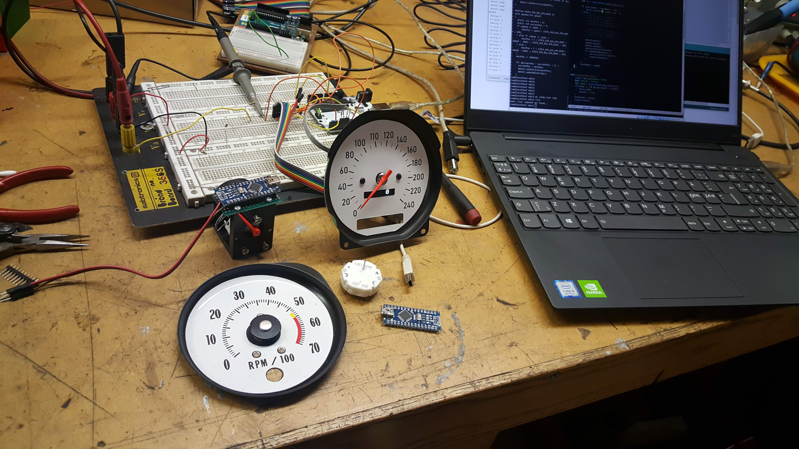

# speedo-and-odometer
Arduino based speedometer and odometer

Made to work for my El Camino 1970 with a Holley Terminator X EFI.

The code is now a bit more generally useful.

The odometer is using a Adafruit Monochrome 128x32 I2C OLED graphic
display [ADA931].  It will store the current km reading in the eeprom
(using a rotating scheme to get more than the 100000 writes per cell).

The speedo is using the SwitechX25 lib.
Beware that this lib has a little flaw when it comes to the zero()
function.  It does not use its acceleration mechanism and steps
may stall.    You may need to tweak this in the SwitechX25.cpp 

```#define RESET_STEP_MICROSEC 800
```



## Usage

### Compile

Use the library manger to fetch the used libs. These are needed:

    #include <Adafruit_GFX.h>
    #include <Adafruit_SSD1306.h>
    #include <SwitecX25.h>

Compile and load the Arduino with the code using the normal Arduino IDE.

### Run

Use the Arduino serial console to configure the speedometer.
You need to issue the following commands:

* `set zeromark value`  To configure the position of the zero speed mark.
* `set maxmark value`   To configure the position of the maximum speed mark
* `set maxspeed value`  To configure what speed it is at the max speed mark

To help you figure out the positions you can use

    moveto position

It will move the dial to the poistion - the position is in terms steps of the Switec motor.
When you have found the position of zero, give `set zero <value>`, and the
position will be saved to the internal eeprom.  Proceed with finding the position for
the max speed mark. 

When you have set the above 3 parameters, you can try it out by simulating
a speed:

    speed 120

## General mounting etc

I used the Arduino Nano for a small form factor and milled out a plastic console
out of POM to hold it all together.

For the tachometer I had to CNC mill a new needle as I couldn't reuse the original.

The speedo will get power from the IGN 12+V, but the tachometer will have constant
battery power. As it will not otherwise be able to go to Zero when you turn off the IGN.

The tachometer code will enter Low Power mode when there are no pulses detected, and
did draw about 2-3 mA (after I desoldered the power LED on the Nano).

The Holley Terminator X was programmed to output the Speed on one of the free output pins.

# draw-gauge.py 

Is a small script that works with the Inkscape Simple Scripting extension 
